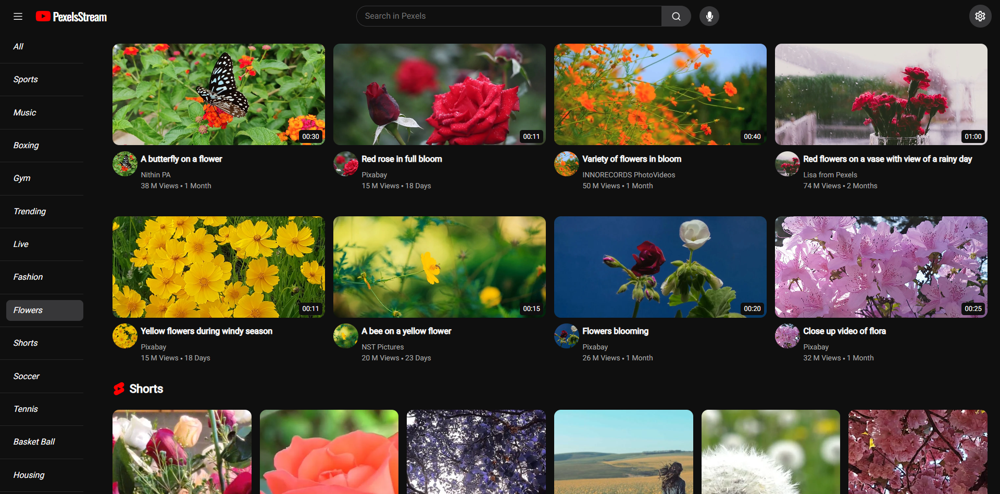
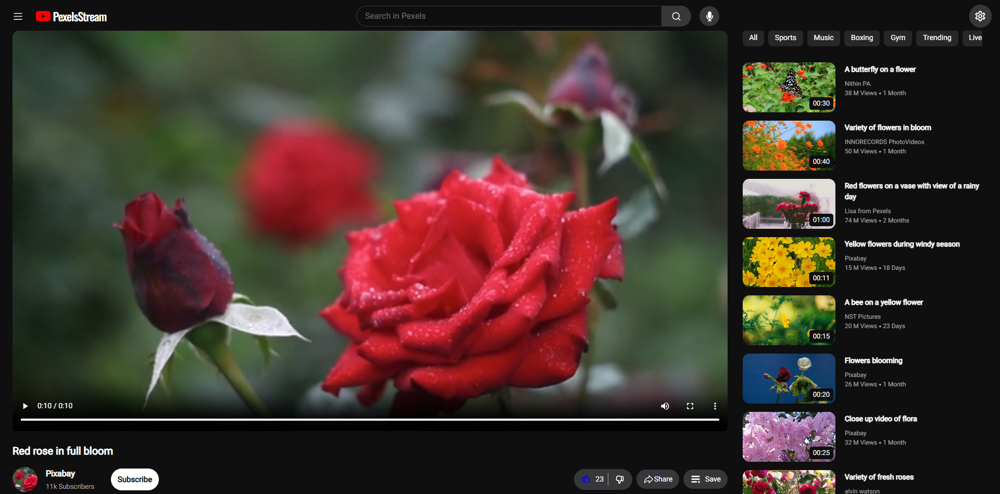

# _PEXELS STREAM_

- **DESCRIPTION :**

  Welcome to Pexels Stream, your ultimate destination for streaming and sharing videos online. With a vast library of content spanning every genre imaginable, Pexels Stream offers endless entertainment for users worldwide. Whether you're a creator looking to share your talents with the world or a viewer searching for the latest trending videos, Pexels Stream has you covered. Explore personalized recommendations, engage with your favorite creators, and discover new content to enjoy. Join our vibrant community today and start streaming on Pexels Stream!

---

- **STACK :**

  - **PEXELS STREAM** : `2.4.0`
  - **FAKER** : `8.4.1`
  - **REACT** : `18.2.0`
  - **PEXELS** : `1.4.0`
  - **TOOLKIT** : `2.2.3`
  - **BOOTSTRAP** : `5.3.5`
  - **REACT ICONS** : `5.0.1`
  - **REACT SHARE** : `5.1.2`
  - **REACT PLAYER** : `2.16.0`
  - **REACT TOOLTIP** : `5.26.3`
  - **REACT ROUTER DOM** : `6.22.3`
  - **STYLED COMPONENTS** : `6.1.8`
  - **REACT SPEECH RECOGNITION** : `3.10.0`

---

- **CREDITS :**

  - **Author : [David Gómez](https://github.com/DavidGomezToca)**
  - **Videos : [PEXELS](https://www.pexels.com)**
  - **Translations : [MyMemory](https://mymemory.translated.net)**
